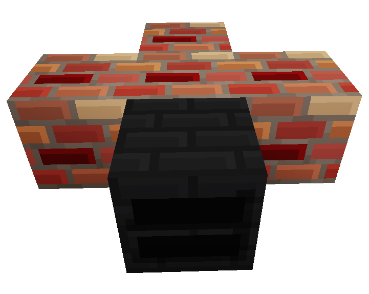
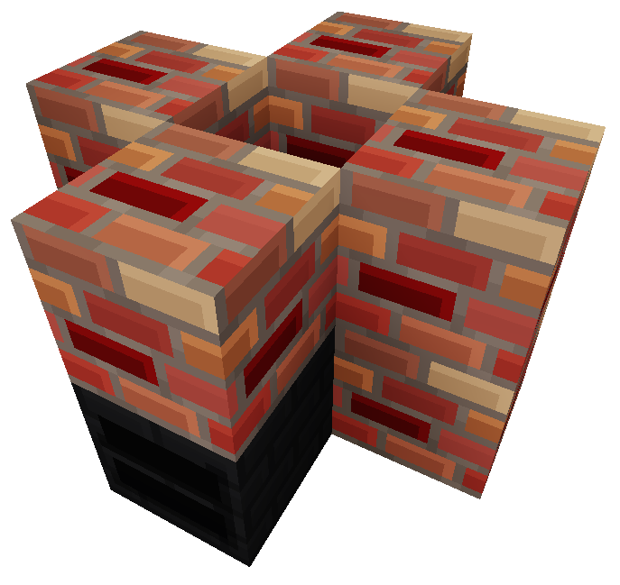
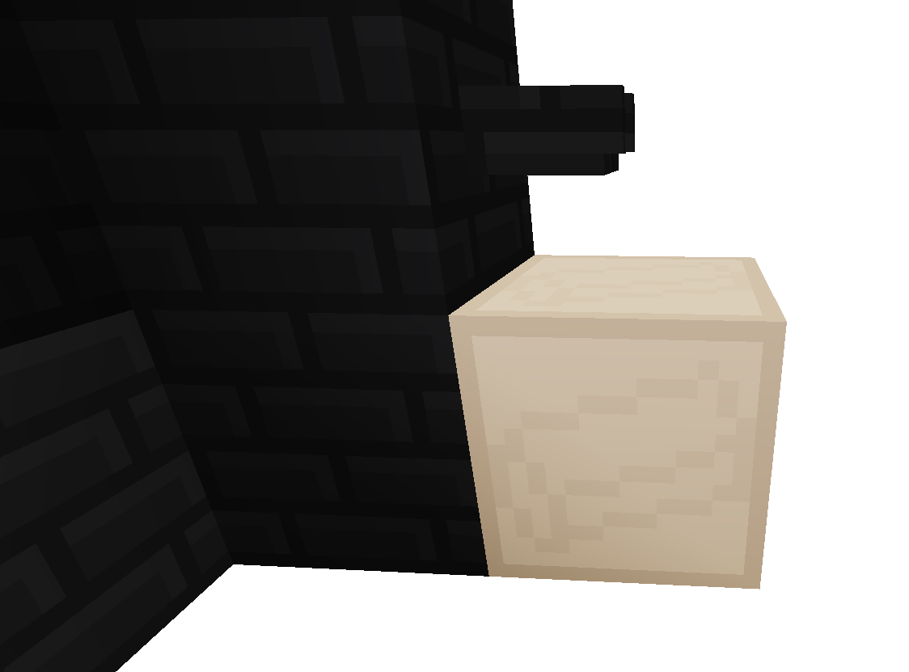

# Journal
Welcome, traveler, to this land. I leave this journal to you, for I have passed from this world long before, but know you will come. I cannot promise your journey will be smooth, but within these pages you will find my notes, may they help you survive, nay, conquer this world.
~ Darin Mysticus

## Starting Off
A good place to begin would be to gather basic materials. You will need wood, from trees, as well as some underbrush, from plants. It is trivial to craft planks from wood, and with these you can make a worktable, allowing more complex crafting.

With your worktable, the wood, and the underbrush, build a sifter. This device allows you to sift dirt and gravel for flint, and sand for shells pieces. For now, flint is important, the shells will come later. However, both of these materials will be useful to you for a long time.

Moving on, flint allows you to make two tools: the flint knife and the flint axe. The flint knife is useful in many ways, from helping craft materials like tinder, to harvesting materials from the world. The flint axe is an excellent early weapon, in case the bandits of my time have not died out. 

With these two tools, the second greatest tool is within your grasp: fire. First, you can use your knife to craft some underbrush or leaves into tinder. Make a good supply of that, as every fire you like will require some. With a bit of tinder, wood, and a lump of flint, make a tinderbox, the source of fire. Next, you will need a campfire, for fire is both a friend and foe. The campfire allows it to be controlled. Craft it with wood, and place flammable materials into it to burn. Then, light it with the tinderbox.

Placing items into the campfire allows them to be cooked. However, this is not particularly efficient, though it does provide light. To upgrade it, all you need is a bit of clay, often found underwater. Placing a full block, and not a lump, onto the campfire turns it into a furnace, which is capable of more advanced cooking. Unlike a campfire, you can use a furnace to make charcoal, by cooking wood or logs.

Charcoal can be used for torches, giving light, or for fuel, and is necessary for future metalworks. 

A few other materials and weapons can be made with these basic materials, including a bucket for moving water, as well as a basic bow and arrows for it.

## The Metal Age
Advancing to the use of metal is essential for progressing beyond simple survival. Everything from food processing to weapons and tool, to advanced magic and machines uses metals. To start on this road, you need a foundry to melt and cast the various metals from ore. The first metal to work with is copper, though, if you find tin, it can be combined to make bronze, a stronger metal.

To start with a foundry, you will need lots of bricks. To make those, you will need more clay. A lot more.
While the clay is smelting into bricks, collect the materials needed for cement. Fortunately, it can all be found by the seashore. Sand makes the base of cement, and lime binds it. Lime can be made from smelting shell bits, found when passing sand through a sifter, or randomly when digging it. You will also need some raw clay for some of the foundry parts.

The first thing is to turn all the bricks into brick blocks. From there, you will need to make a foundry controller, the core piece of a foundry. You will also need to make a Foundry spout, and an ingot mold. 

Place a foundry controller and four brick blocks like so:

Then, on top, place four more brick blocks:

This second layer can be repeated up to a total of three times, to make the whole structure four blocks tall, but just two functions perfectly. More height allows for more metal volume. You can also always add on to an existing foundry till that max height.

Once build, open the foundry controller, and the whole structure should turn black. This means the foundry is ready to go. You can place coal or charcoal in the slots (one item in each) to increase the heat level, or smeltable metals (including ore) into them to melt them, decreasing the heat but increasing the metal. Only one type of metal can be in a foundry at a given time.

When ready to take metal out, take the spout, and place it on the second level of the foundry, with the ingot mold underneath. 

Then, rightclick the spout. Liquid metal should pour out into the mold. The ingot mold is special, it can hold eight separate castings. This means you can pour metal into it eight times, if each pour is one ingot. It will fill with as many as it can, up to eight on any pour. When, after rightclicking the spout, no metal flows, that means the mold is full, or there is no metal. Breaking it will drop the mold and any ingots cast, from zero to eight. The rest of the molds work in the same way, except they can only be cast into once before needing to be broken to get the results.

### From Copper To Steel

While copper is a significant step up from no metal, it is the weakest of metals. Its much better to get some tin, craft two bars together, and re-melt the alloying ingot to make bronze. Bronze tools are harder and last longer, though not as long as iron.

To make stronger tools, a real mine must be established, either cave-diving, or any other way you may fancy. Deeper into the earth, you will find iron ore, a pinkish, rusty color. Taking this ti your foundry (and any coal you found along the way), you can make iron. The first four bars of this strong metal can go to upgrading your workbench to a heavy workbench. This can do everything the previous one could, and more. The rest of the iron bars should be combined with coal to make a steel alloy mixture, which can be melted in the furnace. The first twelve should go to casting an anvil in a special mold. This, along with a furnace, will allow you to fashion tools and armor from iron and steel. While you may find a use for iron tools and weapons later, steel is your best choice now.

### The Advantages of Metal
With metal, particularly steel, now at your disposal, the world opens up to you. You could raid bandit camps for seeds and foodstuffs, not to mention simple metals and metal implements, like copper and bronze. You could find a nice place to build a base. You could explore, find a biome you like, and move there. You could mine deeper, finding silver, gold, gemstones. 

Another thing that has opened up is gardening. Seeds can be obtained from raiding bandit camps or from using a knife to break plants. Food seeds are only available from the camps, though. Even bandits need to eat! Hoes can be made from metal, and seeds can be planted on tilled earth to grow the crops. Be careful, as they do not all take the same amount of time to grow. If you only get seeds when broken, leave it to grow longer next time.

## Enemies
Bandits have camps across the land, and are often well armed. Be prepared when you approach them. They tend to collect loot, seeds, tools, and other items in their chests. As they are mostly interested in wealth, some have had success bribing them with gold.

## Alchemy And Magic
Coming from the *Mundus Mortalum*, or, the World of Mortals, you simply have no magic, like me. That should never stop you, for the world around you is full of it, it simply needs to be harnessed. 

The most basic thing is a stone obelisk that can be used to restore yourself should you meet an untimely demise. Crafted from any stone, these items are very useful.