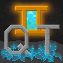

# QuestTest2

QuestTest2 Game for Minetest

## About

QuestTest2 is a game about conquest and exploration. Intended as a high-fantasy game with lots of lore.

As a project, there are two primary purposes:

1. Be a learning platform for people new to programming and game development
2. Be an R&D platform for certain things related to procedural generation

For more information, see DesignDoc.md

QuestTest is licensed under the MIT license. See LICENSE for more info.

## Running

To run this project, you will need to get Minetest from [www.minetest.net](www.minetest.net). At time of writing, you will need Minetest version 5.6.1 or Minetest version 5.7.

Once you download Minetest, find the "games" directory and place the QuestTest2 folder there. For more information, [read the guide](wiki.minetest.net/Games#Installing_games)

Note that this game is not currently on the Minetest ContentDB.

This game is not intended to be run as a multiplayer or server. You can try, it has not been tested.

## Current Status

This project is currently in alpha. It is nowhere near feature complete.

If you found this by chance, congratulations! Feel free to report any bugs you find, by creating an Issue.

For a list of planned features, check out the projects tab on GitHub. 

## FAQ

Q: How do I do X?

A: Please refer to the Journal found in the Journal directory for guided information, or the in-game crafting guide. If you can't find it, create an issue and we will add that thing to the document.

Q: What is up with the name?

A: The game itself is a Quest, meaning, a search, a hunt. We who make the game search for knowledge and experience, while we who play the game search for fun, or maybe just a bit more coal.
